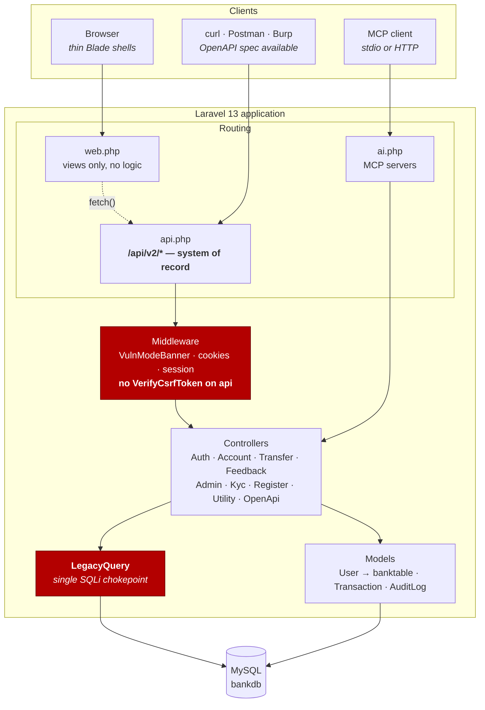
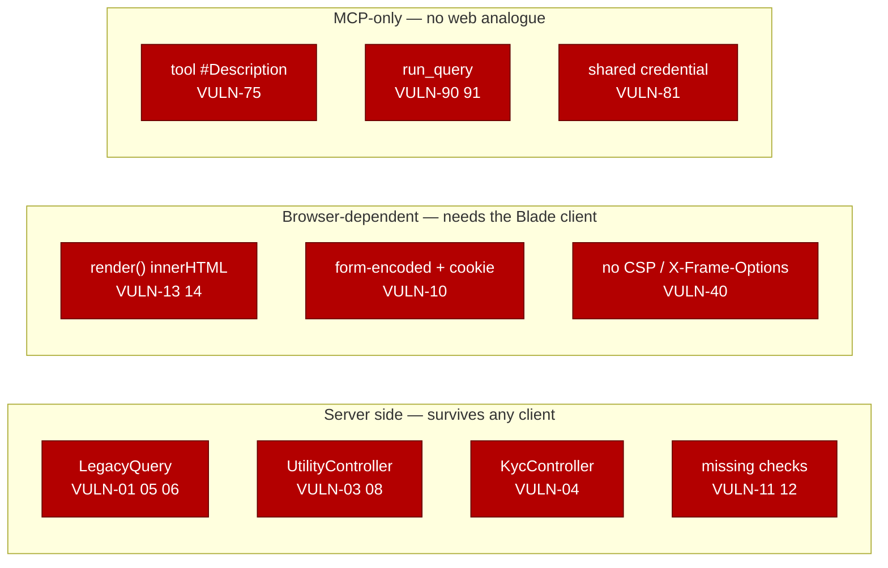
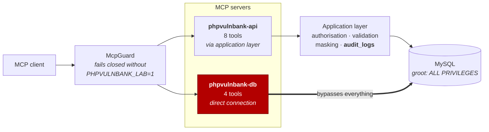
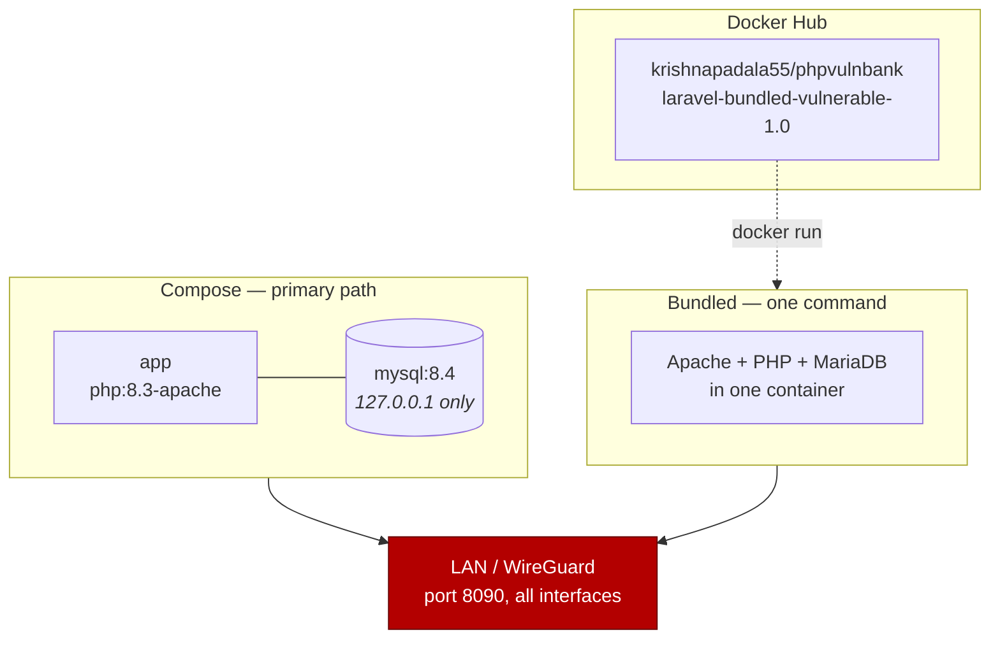
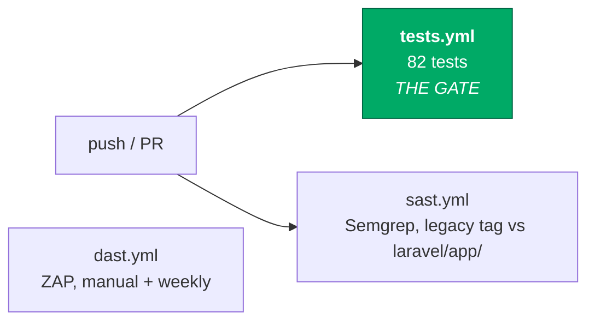

# Architecture

How PHPVulnBank is put together, and where the deliberate flaws live.

Diagrams are Mermaid and render on GitHub. Companion documents:
[`vulnerabilities.md`](vulnerabilities.md) (the lesson catalogue),
[`api-refactor.md`](api-refactor.md) (why it is API-first),
[`mcp-design.md`](mcp-design.md) (the MCP layer),
[`../SECURITY.md`](../SECURITY.md) (how to run it safely).

---

## 1. System overview

The API is the **system of record**. All business logic — and therefore every
server-side vulnerability — sits behind `/api/v2/*`. The browser client holds
none of it.



**Why the client is deliberately thin and framework-free.** Moving behind a JSON
API removed the server-side XSS sink — `application/json` does not execute — so
the vulnerability class *moved* to DOM-based rather than disappearing. It now
lives in one `render()` helper in `layouts/app.blade.php` that writes API data
with `innerHTML`. A React or Vue client would auto-escape by default, meaning the
XSS lessons would have to be fought back in, and a bundler would hide the sink.

---

## 2. Where the vulnerabilities concentrate

Not evenly spread. Four chokepoints carry most of them, which is what makes the
repository auditable.



Two framework defaults had to be **opted out of** deliberately, both documented
in `bootstrap/app.php`:

| Default | Why it was removed |
|---|---|
| `VerifyCsrfToken` on `api` | Needed for `VULN-10`. Also requires form-encoded acceptance — a JSON-only API is not CSRF-able at all |
| `TrimStrings` | Not a security control, but it strips the trailing space from `' or '1'='1' -- `, and MySQL only treats `--` as a comment when followed by whitespace |

---

## 3. The MCP layer — the A/B contrast

Two servers, deliberately. The point is not either one alone, it is the
difference between them.



Run the same action through each, then diff `audit_logs`: one leaves a trail,
the other leaves nothing (`VULN-92`). Every control this application implements
lives in the application layer, and a tool that opens its own connection
discards all of it at once while looking like a sensible latency decision.

Both transports are registered. `stdio` for a student running the lab locally;
HTTP (`POST /mcp/api`, `POST /mcp/db`) so a shared classroom instance is usable
at all, since a client cannot launch a subprocess on someone else's machine.
The HTTP endpoints are unauthenticated — `VULN-80`.

---

## 4. Deployment



`migrate:fresh --seed` rebuilds the whole lab from empty on every start, so a
container is disposable and a student who drops the database costs one command.

**Reaching port 8090 is equivalent to shell access on the container** — two
unauthenticated RCE paths (`VULN-02`, `VULN-03`) plus unauthenticated SQL over
MCP. Isolated lab network only. MySQL stays bound to loopback and is not
widened alongside the app.

---

## 5. CI



**`tests.yml` is the only gate**, and it is inverted from the usual direction:
most of the suite asserts that vulnerabilities **still work**. A failure means a
lesson has been silently repaired — by a framework upgrade, a linter, or a
well-meaning contributor — which is this project's primary risk.

The scanners are teaching material, not gates. `sast.yml` scans the legacy tree
and `laravel/app/` **separately** and reports the delta: same 28 vulnerabilities,
far fewer findings, because Semgrep recognises Eloquent and Blade as safe. The
legacy tree is no longer in the working directory — the workflow materialises it
from the `legacy-flat-php` tag, so that tag must not be deleted. `dast.yml` frames its output as a coverage gap — a
scanner finds reflected XSS and missing headers, not the IDOR, the
negative-amount transfer, the race condition, or the `troy` backdoor.

CodeQL is not used: **it does not support PHP.**

---

## 6. Repository layout

```
├── laravel/                the application
│   ├── app/
│   │   ├── Http/Controllers/Api/V2/    all business logic
│   │   ├── Mcp/{Servers,Tools}/        MCP layer
│   │   ├── Models/                     User → banktable, Transaction, AuditLog
│   │   └── Support/                    LegacyQuery, McpGuard, OpenApiSpec
│   ├── resources/views/    thin Blade shells + the innerHTML render helper
│   ├── routes/             web.php · api.php · ai.php
│   ├── tests/Feature/Exploits/         asserts vulnerabilities still work
│   ├── Dockerfile          compose variant
│   └── Dockerfile.bundled  single-container variant
├── payload/csrf/           CSRF proof of concept
├── docs/                   this file and the design documents
└── SECURITY.md             read before running
```

Removed in July 2026: the legacy application (`src/`), its build scaffolding
(root `Dockerfile`, `dock/`, `dbscript/`), the Jenkins and Azure pipelines, the
`DevSecOpS/` scan scripts, and the unused Vite/npm chain.

The legacy application is tagged **`legacy-flat-php`** — `git checkout
legacy-flat-php` retrieves it, and `sast.yml` materialises it from there for the
comparison above. The published legacy Docker images are self-contained and
still run.
